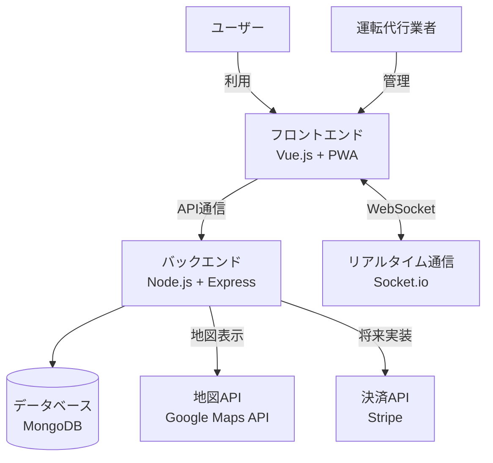

```mermaid
graph TD
    User[ユーザー] -->|利用| Frontend[フロントエンド\nVue.js + PWA]
    Provider[運転代行業者] -->|管理| Frontend
    Frontend -->|API通信| Backend[バックエンド\nNode.js + Express]
    Frontend <-->|WebSocket| RealTime[リアルタイム通信\nSocket.io]
    Backend --> Database[(データベース\nMongoDB)]
    Backend -->|地図表示| MapAPI[地図API\nGoogle Maps API]
    Backend -->|将来実装| PaymentAPI[決済API\nStripe]
```
