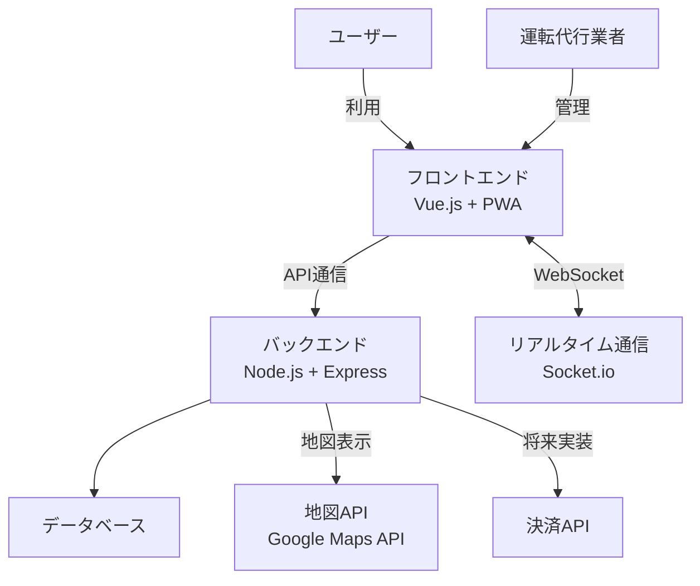

```mermaid
graph TD
    User[ユーザー] -->|利用| Frontend["フロントエンド<br>Vue.js + PWA"]
    Provider[運転代行業者] -->|管理| Frontend
    Frontend -->|API通信| Backend["バックエンド<br>Node.js + Express"]
    Frontend <-->|WebSocket| RealTime["リアルタイム通信<br>Socket.io"]
    Backend --> Database["データベース"]
    Backend -->|地図表示| MapAPI["地図API<br>Google Maps API"]
    Backend -->|将来実装| PaymentAPI["決済API"]
```
